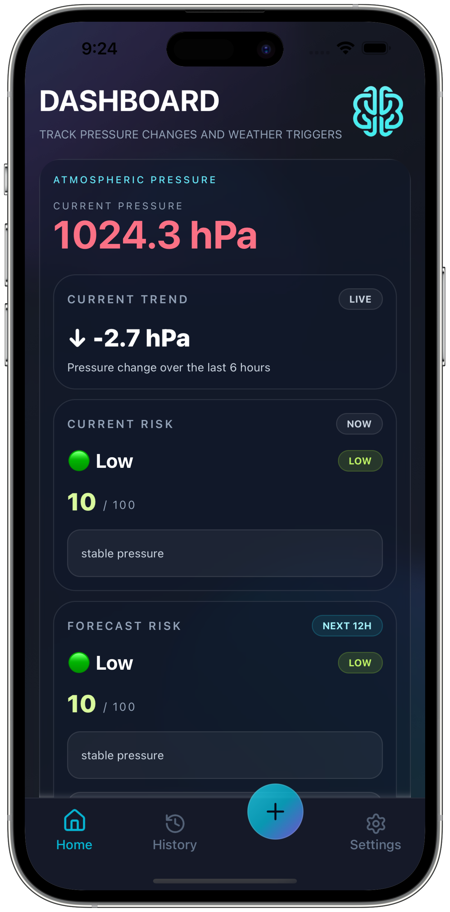
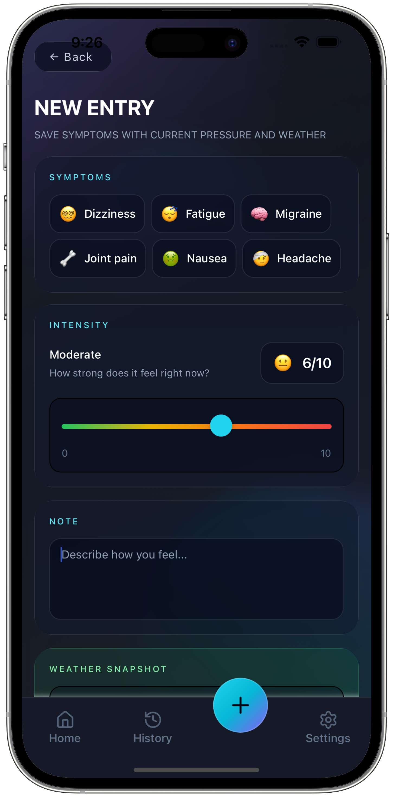
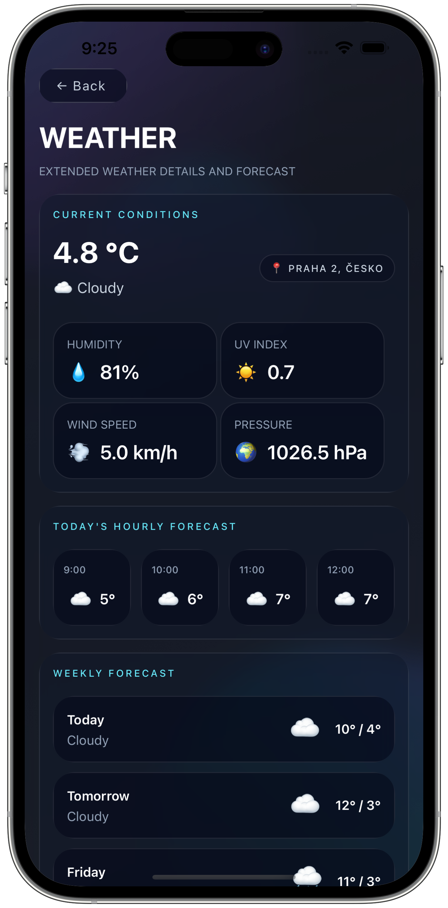

# 🌦️ Meteo Mind

Smart weather & health tracking app that helps you understand how atmospheric conditions affect your body — especially headaches, migraines, and other symptoms.


---

## 🧠 What is this app?

Meteo Health combines:

- 🌡️ Weather data (pressure, temperature, forecast)
- 📊 Your personal symptom history
- 🤖 Prediction engine

…to give you **personalized insights and predictions** like:

> ⚠️ Migraine probability high tonight  
> Pressure drop -6.2 hPa in the next 6 hours

---

## 🚀 Features

### 🌍 Weather Tracking
- Current weather conditions
- Atmospheric pressure monitoring
- Hourly forecast (today)
- 7-day forecast
- Weather metrics (humidity, UV index, wind speed)

---

### 📈 Pressure & Trends
- Pressure trend detection (3h / 6h / 12h)
- Visual pressure chart
- Forecast risk analysis

---

### 🧠 Personal Risk Engine
- Learns from your historical symptom entries
- Detects patterns (e.g. migraines during pressure drops)
- Applies **personal risk bonus** to predictions

---

### 🔮 Symptom Prediction
- Predicts:
  - Migraine
  - Headache
  - Joint pain
  - Nausea
  - Dizziness
  - Fatigue
- Risk levels:
  - 🟢 Low
  - 🟡 Moderate
  - 🔴 High

---

### ⚠️ Smart Alerts
- Highlighted prediction alerts on home screen
- Context-aware (pressure change + personal history)
- Future-ready for push notifications

---

### 📊 Data Insights
- Symptom patterns (average pressure, trends)
- Timeline visualization
- Filtering by symptom type

---

### 🧾 Data Management
- Export entries to CSV
- Delete all entries
- User settings stored in Firestore

---

## 🛠️ Tech Stack

### 📱 Frontend
- **React Native (Expo)**
- **Expo Router**
- **NativeWind (Tailwind CSS for RN)**
- **React Native Reanimated**

### 📊 Charts & UI
- `react-native-chart-kit`
- Custom reusable UI components

### ☁️ Backend & Data
- **Firebase (Firestore)**
- User-based data storage
- Prepared for Cloud Functions (future notifications)

### 🌦️ Weather API
- **Open-Meteo API**
- No API key required
- High-quality hourly & daily forecast data

### 📍 Location
- `expo-location`
- Reverse geocoding (city + country)

---

## 🧩 Architecture Highlights

- Modular component structure
- Custom hooks:
  - `useWeather`
  - `useSymptomEntries`
  - `useAuth`
- Separation of logic:
  - `utils/pressure`
  - `utils/personalRisk`
  - `utils/symptomPrediction`
- Scalable prediction system (easy to extend with ML later)

---

## 📱 App Preview

<p align="center">
  
  
  
</p>

---

## 🌐 Full Demo & Details

👉 See full presentation with videos, features and UX breakdown:

🔗 https://meteo-mind.vercel.app/

---

## 🔮 Future Roadmap

- 🔔 Push notifications (server-side)
- 📱 Android home widget (live alerts)
- 🧠 Advanced ML prediction model
- ☁️ Cloud-based prediction engine
- 📊 Correlation graphs (symptom vs pressure)

---

## ⚙️ Installation

### 📱 Try the app (Preview APK)

You can install a preview version of the app directly on your Android device:

👉 Download APK:  
https://expo.dev/accounts/krejzy23/projects/meteo-app/builds/1dcac20c-ed7a-4e48-b412-2f9011c869fc

Or scan the QR code:

<p align="center">
  
</p>

> ⚠️ This is a preview build distributed via Expo (not from Google Play).

---

### 🧪 Run locally

```bash
git clone https://github.com/your-username/meteo-health.git
cd meteo-health
npm install
npm start